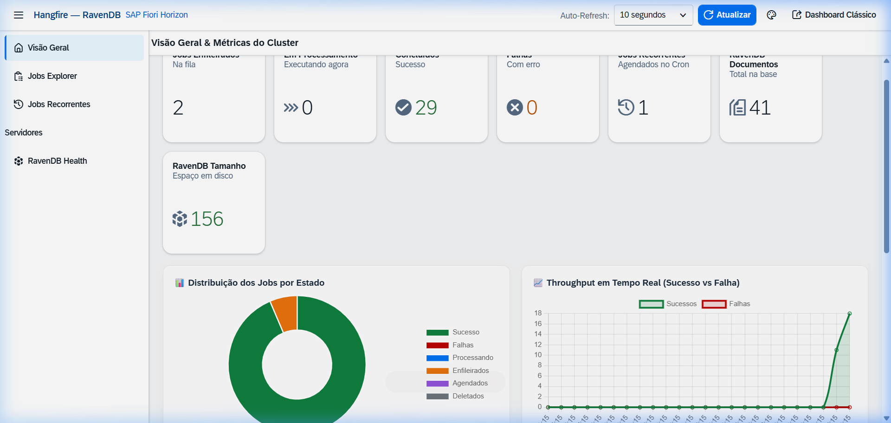
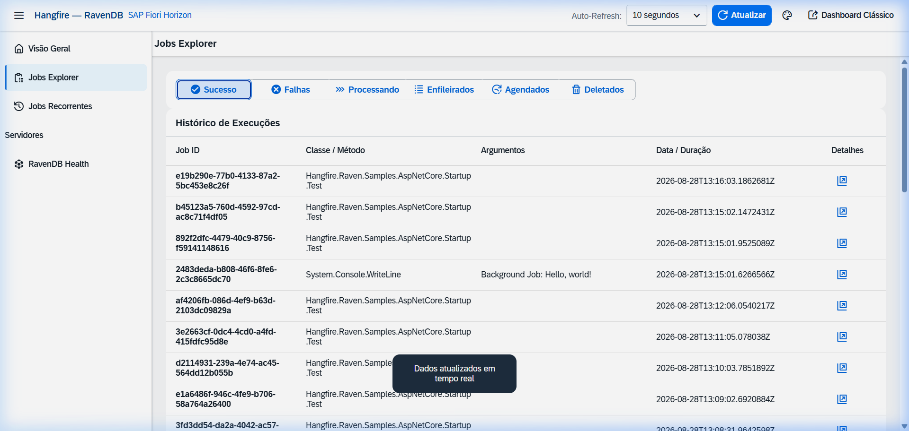
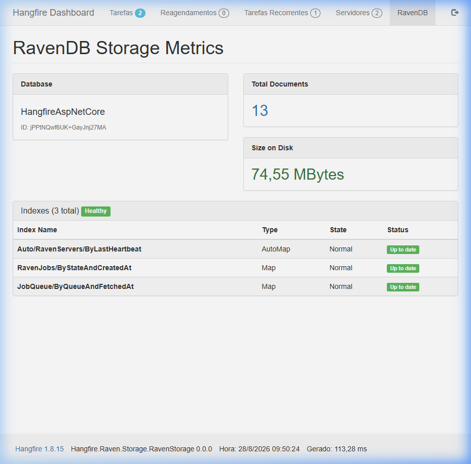

# Job.Hangfire.Raven6x

[](https://github.com/kelvinaxhcar/Job-Hangfire-RavenDB/actions/workflows/ci.yml)
[](https://www.nuget.org/packages/Job.Hangfire.Raven6x/)
[](https://www.nuget.org/packages/Job.Hangfire.Raven6x/)
[](https://www.gnu.org/licenses/lgpl-3.0)
[](https://dotnet.microsoft.com/)
[](https://ravendb.net/)

**Job.Hangfire.Raven6x** is a high-performance, robust RavenDB 6.x storage provider for [Hangfire](https://www.hangfire.io/). It enables Hangfire to persist background jobs, recurring tasks, queues, states, and distributed locks directly inside RavenDB.

---

## Features

- ⚡ **High-Performance Batched Operations**: Uses lazy batch loading and statistics queries to eliminate memory bottlenecks on dashboard metrics and multi-queue lookups.
- 🌐 **Cluster High Availability & Connection Pooling**: Multi-node RavenDB cluster support (`Urls`) with automatic client-side failover, request balancing, and connection pooling.
- 🔒 **Cluster-Wide Compare Exchange Distributed Lock**: Atomic distributed locks backed by RavenDB Compare Exchange with heartbeat renewal.
- 📦 **Atomic Patches**: Utilizes RavenDB deferred JavaScript patches for high-throughput counters, set operations, and queue mutations.
- ⏱️ **Automatic Expiration & TTL**: Native document expiration support for completed/expired jobs, stats, and locks.
- 📊 **Real-Time OpenUI5 / SAP Fiori Enterprise Dashboard**: Modern Single Page Application with interactive real-time charts (Chart.js), analytical KPI tiles, Jobs Explorer with fast filters, cluster servers, and theme switcher (Horizon Light / Dark).
- 🚀 **High-Throughput Bulk Insert (`IJobStorageBatchConnection`)**: Native streaming `BulkInsert` operation for enqueuing thousands of jobs per second with minimal memory and HTTP overhead.
- ⚡ **Native Asynchronous Operations (`IStorageConnectionAsync` & `IWriteOnlyTransactionAsync`)**: Full non-blocking async storage operations backed by RavenDB's `IAsyncDocumentSession` and `SaveChangesAsync()`.
- 📜 **Immutable Job State Audit Trail (RavenDB Revisions)**: Native Document Revisions integration capturing the full lifecycle and state transitions of every job with compliance audit history.
- 🔔 **Event-Driven Dequeue (RavenDB Changes API)**: Instant push-based queue notifications (< 1ms latency) via WebSocket changes listener with automatic polling fallback.
- 🦅 **RavenDB Storage & Index Metrics**: Full cluster observability (database size, total documents, index health status).

---

## Dashboards

### 1. OpenUI5 / SAP Fiori Horizon Dashboard (`/hangfire/ui5`)
Modern enterprise interface designed with **SAP Fiori Horizon**, featuring real-time animated charts, KPI tiles, job filters, active cluster servers, and automatic refresh:



#### Jobs Explorer & Status Filters:


### 2. Classic Hangfire Dashboard with RavenDB Metrics (`/hangfire/ravendb`)
Extends the classic Hangfire dashboard with dedicated RavenDB storage metrics, document counters, and index health:



---

## Installation

Install the package from [NuGet](https://www.nuget.org/packages/Job.Hangfire.Raven6x/):

### .NET CLI
```bash
dotnet add package Job.Hangfire.Raven6x
```

### Package Manager
```powershell
Install-Package Job.Hangfire.Raven6x
```

---

## Configuration & Usage

### 1. ASP.NET Core Integration (Single Node or Cluster)

In your `Program.cs` or `Startup.cs`:

```csharp
using Hangfire;
using Hangfire.Raven;
using Hangfire.Raven.Dashboard;
using Hangfire.Raven.Storage;

var builder = WebApplication.CreateBuilder(args);

// Configure Hangfire with RavenDB Storage (Single Node or Multi-Node Cluster)
builder.Services.AddHangfire(config =>
{
    config.SetDataCompatibilityLevel(CompatibilityLevel.Version_180)
          .UseSimpleAssemblyNameTypeSerializer()
          .UseRecommendedSerializerSettings()
          // For Multi-Node Cluster with native failover and connection pooling:
          .UseRavenStorage(new[] { "http://node1:8080", "http://node2:8080", "http://node3:8080" }, "HangfireDB", new RavenStorageOptions
          {
              InvisibilityTimeout = TimeSpan.FromMinutes(30),
              QueuePollInterval = TimeSpan.FromSeconds(2),
              DistributedLockLifetime = TimeSpan.FromMinutes(1),
              EnableCache = true,
              CacheSlidingExpiration = TimeSpan.FromSeconds(3)
          })
          .UseRavenDashboard(); // Activates RavenDB Metrics and OpenUI5 / SAP Fiori Dashboard
});

// Add Hangfire Server
builder.Services.AddHangfireServer(options =>
{
    options.WorkerCount = Environment.ProcessorCount * 5;
    options.Queues = new[] { "critical", "default", "low" };
});

var app = builder.Build();

// Enable Hangfire Dashboard
// Access Classic Dashboard: /hangfire
// Access RavenDB Metrics:   /hangfire/ravendb
// Access OpenUI5 Dashboard: /hangfire/ui5
app.UseHangfireDashboard("/hangfire");

app.Run();
```

### 2. Multi-Node Cluster Setup with Certificate Authentication

For production environments using secure RavenDB clusters (X.509 Certificate):

```csharp
var clusterUrls = new[] { "https://a.ravendb.mycompany.com", "https://b.ravendb.mycompany.com", "https://c.ravendb.mycompany.com" };
var clientCert = new X509Certificate2("cluster_client_cert.pfx", "cert_password");

GlobalConfiguration.Configuration
    .UseRavenStorage(clusterUrls, "HangfireDB", clientCert, new RavenStorageOptions
    {
        EnableCache = true,
        CacheSlidingExpiration = TimeSpan.FromSeconds(3)
    });
```

### 3. Standalone / Console Application

```csharp
using Hangfire;
using Hangfire.Raven;

GlobalConfiguration.Configuration
    .UseRavenStorage(new[] { "http://node1:8080", "http://node2:8080" }, "HangfireDB");

using (var server = new BackgroundJobServer())
{
    Console.WriteLine("Hangfire Server started. Press any key to exit...");
    Console.ReadKey();
}
```

### 4. ASP.NET Core Health Checks

Monitor RavenDB connectivity, database existence, and index health for container orchestrators (Kubernetes, Docker Swarm):

```csharp
using Hangfire.Raven.Extensions;

// Register RavenDB health check (resolves RavenStorage / DocumentStore automatically from DI)
builder.Services.AddHealthChecks()
    .AddRavenDb(name: "ravendb", tags: new[] { "db", "ready" });

// Or specify options to customize stale index thresholds:
builder.Services.AddHealthChecks()
    .AddRavenDb(name: "ravendb", configureOptions: options =>
    {
        options.CheckStaleIndexes = true;
        options.MaxAllowedStaleIndexes = 0;
    });

// Map Health Check endpoint
app.MapHealthChecks("/healthz");
```

---

## Creating Background Jobs

### Fire-and-Forget Jobs
Executes once, immediately in the background:
```csharp
var jobId = BackgroundJob.Enqueue(() => Console.WriteLine("Fire-and-forget job executed!"));
```

### Delayed Jobs
Executes after a specified delay or at a future time:
```csharp
var jobId = BackgroundJob.Schedule(
    () => Console.WriteLine("Delayed job executed!"),
    TimeSpan.FromDays(7));
```

### Recurring Jobs
Executes repeatedly according to a CRON schedule:
```csharp
RecurringJob.AddOrUpdate(
    "daily-report",
    () => Console.WriteLine("Daily report generated!"),
    Cron.Daily);
```

### Continuations
Chains dependent jobs that run automatically when the parent job finishes:
```csharp
var parentJobId = BackgroundJob.Enqueue(() => Console.WriteLine("Parent task completed!"));
BackgroundJob.ContinueJobWith(parentJobId, () => Console.WriteLine("Continuation task executed!"));
```

### High-Performance Bulk Enqueue
Stream hundreds or thousands of jobs directly into RavenDB in a single batch:
```csharp
using Hangfire.Raven.Extensions;

var tasks = Enumerable.Range(1, 1000)
    .Select(i => (Expression<Action>)(() => ProcessOrder(i)));

List<string> jobIds = JobStorage.Current.BulkEnqueue(tasks, queue: "heavy-processing");
```

---

## Configuration Options

You can customize the storage behavior by passing `RavenStorageOptions`:

```csharp
var options = new RavenStorageOptions
{
    // Interval between queue polls when no items are pending
    QueuePollInterval = TimeSpan.FromSeconds(2),

    // Invisibility timeout before an unacknowledged fetched job is made available again
    InvisibilityTimeout = TimeSpan.FromMinutes(30),

    // Lifetime of distributed locks before automatic expiry/cleanup
    DistributedLockLifetime = TimeSpan.FromMinutes(1),

    // Enable in-memory caching with sliding expiration for high-frequency reads
    EnableCache = true,
    CacheSlidingExpiration = TimeSpan.FromSeconds(3),

    // Enable RavenDB document revisions for job audit trailing
    EnableJobRevisions = true,
    PurgeJobRevisionsOnDelete = false,
    MinimumJobRevisionsToKeep = 50,

    // Unique client identifier for lock tracking
    ClientId = Guid.NewGuid().ToString()
};
```

---

## Development & Testing

### Prerequisites
- [.NET 7.0 SDK](https://dotnet.microsoft.com/) or higher (.NET 8.0 / .NET 9.0 supported)
- [RavenDB 6.x](https://ravendb.net/download) instance or Docker container

### Building the Project
```bash
git clone https://github.com/kelvinaxhcar/Job-Hangfire-RavenDB.git
cd Job-Hangfire-RavenDB
dotnet build
```

### Running Tests
```bash
dotnet test
```

---

## Contributing

Contributions, issues, and feature requests are welcome! Feel free to check the [issues page](https://github.com/kelvinaxhcar/Job-Hangfire-RavenDB/issues) and read the [CONTRIBUTING.md](CONTRIBUTING.md) guide before opening a PR.

---

## License

This project is licensed under the **GNU Lesser General Public License v3.0 (LGPL-3.0)**. See the [LICENSE](LICENSE) file for more details.
